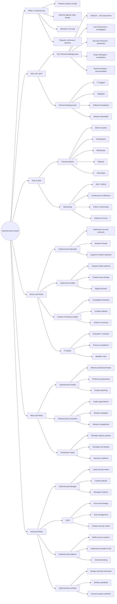

```mermaid
graph LR

    A((Cybersecurity Careers))

    %% Section 1
    A --> B[What is Cybersecurity]
    B --> B1["Protects systems & data"]
    B --> B2["Defends against cyber threats"]
    B --> B3["Maintains CIA triad"]
    B --> B4["Requires continuous learning"]

    %% Section 2
    A --> C[Who Can Join?]

    C --> C1[Non-Technical Backgrounds]
    C1 --> C1a["Veterans – risk assessment"]
    C1 --> C1b["Law Enforcement – investigation"]
    C1 --> C1c["Security Personnel – awareness"]
    C1 --> C1d["Project Managers – coordination"]
    C1 --> C1e["Technical Writers – documentation"]

    C --> C2[Technical Backgrounds]
    C2 --> C2a["IT Support"]
    C2 --> C2b["Helpdesk"]
    C2 --> C2c["Software Developers"]
    C2 --> C2d["Network Specialists"]

    %% Section 3
    A --> D[How to Start]

    D --> D1[Training Options]
    D1 --> D1a["Online Courses"]
    D1 --> D1b["Certifications"]
    D1 --> D1c["Bootcamps"]
    D1 --> D1d["Degrees"]
    D1 --> D1e["Internships"]

    D --> D2[Networking]
    D2 --> D2a["ISC2 / ISACA"]
    D2 --> D2b["Conferences & Webinars"]
    D2 --> D2c["Online Communities"]
    D2 --> D2d["GitHub & Forums"]

    %% Section 4
    A --> E[Entry-Level Roles]

    E --> E1["Cybersecurity Specialist"]
    E1 --> E1a["Implements security protocols"]
    E1 --> E1b["Monitors threats"]
    E1 --> E1c["Supports incident response"]

    E --> E2["Cybercrime Analyst"]
    E2 --> E2a["Analyzes attack patterns"]
    E2 --> E2b["Predicts future threats"]
    E2 --> E2c["Digital forensics"]

    E --> E3["Incident & Intrusion Analyst"]
    E3 --> E3a["Investigates breaches"]
    E3 --> E3b["Contains attacks"]
    E3 --> E3c["Assists in recovery"]

    E --> E4["IT Auditor"]
    E4 --> E4a["Evaluates IT systems"]
    E4 --> E4b["Ensures compliance"]
    E4 --> E4c["Identifies risks"]

    %% Section 5
    A --> F[Mid-Level Roles]

    F --> F1["Cybersecurity Analyst"]
    F1 --> F1a["Monitors advanced threats"]
    F1 --> F1b["Performs assessments"]
    F1 --> F1c["Incident planning"]

    F --> F2["Cybersecurity Consultant"]
    F2 --> F2a["Audits organizations"]
    F2 --> F2b["Designs strategies"]
    F2 --> F2c["Advises management"]

    F --> F3["Penetration Tester"]
    F3 --> F3a["Ethically exploits systems"]
    F3 --> F3b["Simulates real attacks"]
    F3 --> F3c["Improves resilience"]

    %% Section 6
    A --> G[Advanced Roles]

    G --> G1["Cybersecurity Manager"]
    G1 --> G1a["Leads security teams"]
    G1 --> G1b["Creates policies"]
    G1 --> G1c["Manages incidents"]

    G --> G2["CISO"]
    G2 --> G2a["Exec-level strategy"]
    G2 --> G2b["Risk management"]
    G2 --> G2c["Creates security culture"]

    G --> G3["Cybersecurity Engineer"]
    G3 --> G3a["Builds secure systems"]
    G3 --> G3b["Implements firewalls & IDS"]
    G3 --> G3c["Conducts testing"]

    G --> G4["Cybersecurity Architect"]
    G4 --> G4a["Designs security framework"]
    G4 --> G4b["Defines standards"]
    G4 --> G4c["Ensures system cohesion"]
```
